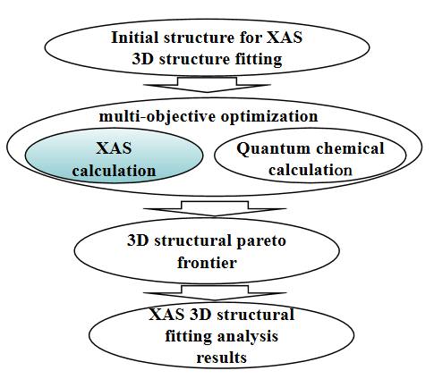
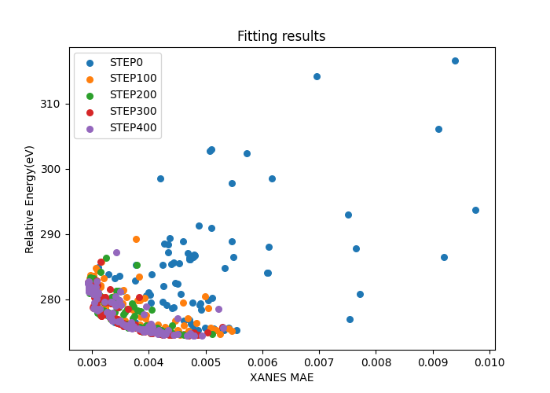

# XAS_MultiObjective_Fitting_StructuralStability
Multi-objective fitting of XAS spectroscopy and structural stability.

# Multi-objective XAS 3D structure fitting incorporating accounting for structural reasonableness
X-ray absorption spectroscopy (XAS) is a powerful tool for probing local three-dimensional structures of complexes, but its analysis often suffers from the multiple-solution problem. Here we propose a multi-index XAS three-dimensional structure fitting method that explicitly considers structural stability. The method formulates the fitting as a multi-objective optimization problem, where structural stability indicators (e.g., enthalpy of formation or single-point energy) and agreement with experimental spectra (e.g., R-factor) are simultaneously optimized, with three-dimensional structural parameters as decision variables and thresholds of structural variation as constraints. The algorithm follows a non-dominated sorting genetic algorithm (NSGA-II) procedure: initial population generation, evaluation of both energy and spectral fitting indicators, non-dominated sorting with diversity preservation, and iterative selection, crossover, and mutation until the maximum generation is reached. We demonstrate the method on an Fe complex with 1,10-phenanthroline ligands, treating each ligand as a rigid body. The enthalpy of formation is computed by the PM6 semi-empirical method, while theoretical XAS spectra are calculated using the multiple-scattering formalism (FDMNES), with inner-layer parameters optimized by the DirectL algorithm. The optimization yields a Pareto front of solutions, from which three-dimensional structures that are both relatively stable and in good agreement with experimental spectra are obtained. This approach effectively mitigates the multiple-solution ambiguity inherent in XAS fitting and can be readily extended to simultaneous fitting of multi-element XAS spectra (e.g., Ni and K-edges in Ni-Fe layered double hydroxides), offering a new perspective for XANES analysis.
## Method Overview
A multi-index X-ray absorption spectroscopy (XAS) three-dimensional structure fitting method considering structural stability, characterized in that three-dimensional structural stability and agreement with experimental spectra are optimization objectives, three-dimensional structural parameters are decision variables, and thresholds set by three-dimensional structural variation parameters are constraints.

## Input and Output
A multi-index X-ray absorption spectroscopy three-dimensional structure fitting method considering structural stability, characterized in that:

**Input:** experimental XAS data $y_{\mathrm{exp}}$, initial guessed three-dimensional structure $S_{\mathrm{ini}}$;

**Output:** a solution set of three-dimensional structures $\{ S_{i}^{\mathrm{results}} \}$.

## Fitting Indicators
A multi-index X-ray absorption spectroscopy (XAS) three-dimensional structure fitting method considering structural stability, characterized in that it comprises multiple fitting indicators. The fitting indicators are divided into two categories: structural stability indicators and XAS spectrum fitting indicators for given elements. For an intermediate three-dimensional structure $S_{\mathrm{int}}$ generated during the fitting process, its XAS spectrum fitting indicator is the difference between the calculated spectrum $y_{\mathrm{the\_int}}$ (computed based on $S_{\mathrm{int}}$) and the experimental spectrum $y_{\mathrm{exp}}$, and this indicator can be mean absolute error, R-factor, or similar metrics. For the intermediate three-dimensional structure $S_{\mathrm{int}}$ generated during the fitting process, its structural stability indicator is an energy metric computed based on $S_{\mathrm{int}}$, which can be the enthalpy of formation calculated using semi-empirical methods, the single-point energy calculated using first-principles methods, or similar metrics.

## Algorithm Procedure
A multi-index X-ray absorption spectroscopy three-dimensional structure fitting method considering structural stability, characterized in that the method specifically comprises the following steps:

**Step 1**

Generate an initial population $P_{0}$ of three-dimensional structural parameters. By varying the initial three-dimensional structure $S_{\mathrm{ini}}$, generate a set of three-dimensional structures $\{ S_{j}^{P_{0}} \}$ corresponding to the structural parameter population $P_{0}$, where $j = 1$ to $N_{\mathrm{ini}}$, and $N_{\mathrm{ini}}$ is the preset number of initially generated structures. Compute the energy indicators and XAS spectrum fitting indicators for the $N_{\mathrm{ini}}$ three-dimensional structures. Based on non-dominated sorting and diversity metrics, select $N_{\mathrm{pop}}$ individuals to form the first-generation population $P_{1}$, where $N_{\mathrm{pop}}$ is the preset population size.

**Step 2**

Perform selection, crossover, and mutation operations on the population $P_{t}$ to generate an offspring population $Q_{t}$. Merge $P_{t}$ and $Q_{t}$ to obtain the population $R_{t}$. By varying the initial three-dimensional structure $S_{\mathrm{ini}}$, generate a set of three-dimensional structures $\{ S_{j}^{R_{t}} \}$ corresponding to the structural parameter population $R_{t}$, where $j = 1$ to $2N_{\mathrm{pop}}$, and $N_{\mathrm{pop}}$ is the preset population size. Compute the energy indicators and XAS spectrum fitting indicators for the $2N_{\mathrm{pop}}$ three-dimensional structures. Perform non-dominated sorting and diversity metric calculation, and select $N_{\mathrm{pop}}$ individuals to form the next-generation population $P_{t+1}$.

**Step 3**

Check whether the preset maximum number of generations $t_{\mathrm{max}}$ has been reached. If yes, terminate the algorithm; otherwise, repeat Step 2.
